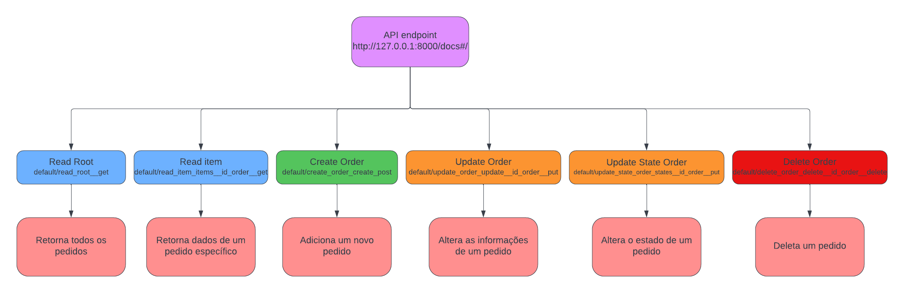
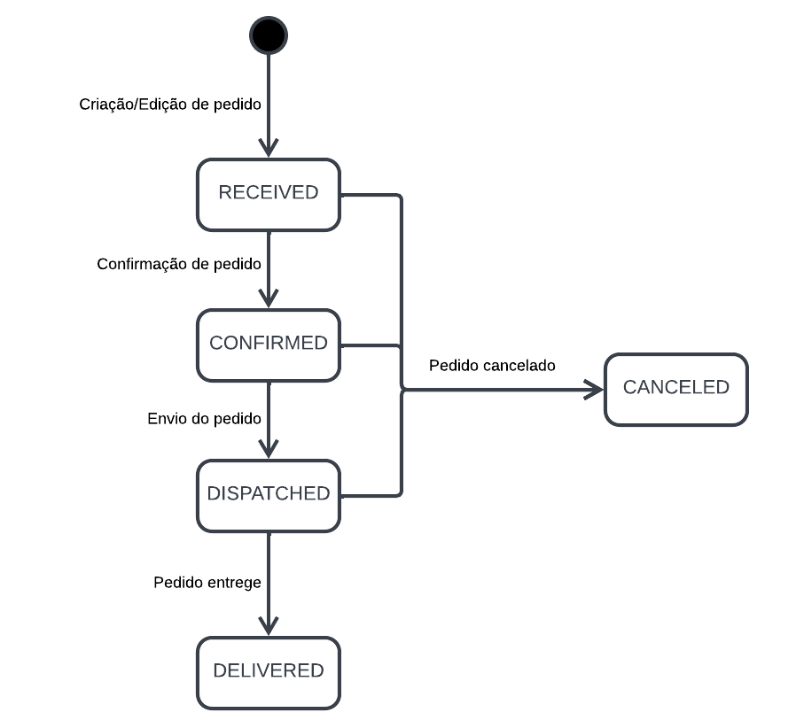

# Delivery_API_challenge

Essa é uma API chamada de "delivery-api" foi desenvolvida para o desafio do cblab, ela permite realizar o CRUD de um pedido além de permitir alterar seu estado.

## 🚀 Começando

Clone o repositório.
```
$ git clone https://github.com/Nicolas-Roberto/Delivery_API_challenge.git
```

Instale o python

Linux(Ubunto)
```
$ sudo apt update
$ sudo apt install python3
```

Windows 10

Baixe e instale a última versão do python
```
https://www.python.org/downloads/
```

Instale as dependencias
```
$ pip3 install -r requirements.txt
```

No diretório do projeto vá para a pasta app
```
$ cd app
```

Rode a main
```
$ uvicorn main:app 
```

Abra no navegador 
```
http://127.0.0.1:8000/docs#/
```

## 🛠️ Construído com

* [FastAPI](https://fastapi.tiangolo.com/) 
* [pydantic](https://pydantic-docs.helpmanual.io/) 
* [Uvicorn](https://www.uvicorn.org/) 


## 📦 Desenvolvimento

Os dados são armazenados em memória durante a execução
da API, o funcionamento do sistema pode ser visto neste diagrama:

*Diagrama da API*


<br/>
Além do CRUD, a máquina de estados foi implementada seguindo o seguinte diagrama.

*Diagrama de estados*


       
